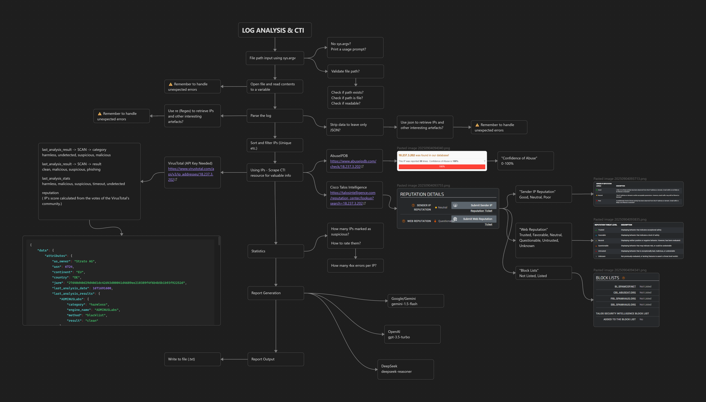

# LogCTIAI Wiki

Welcome to the LogCTIAI wiki. This project analyzes large web/server logs, enriches them with optional LLM reasoning, and performs efficient CTI lookups — all designed to run offline‑first and on a budget.

- Quickstart: installation and first run
- CLI: all flags and examples
- CTI + LLM Strategy: grouping, sampling, gates, cache, budgets
- Development: repo structure, testing, style
- FAQ: common questions and troubleshooting

Useful links:
- README (repo root)
- Usage guide: docs/USAGE.md
- Streamlit UI: ui/

